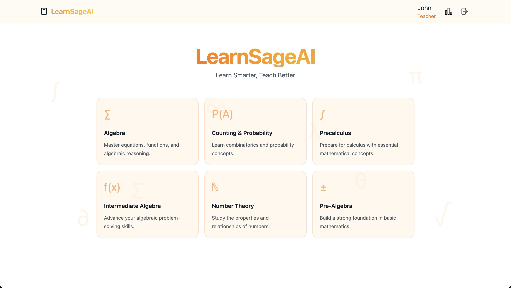
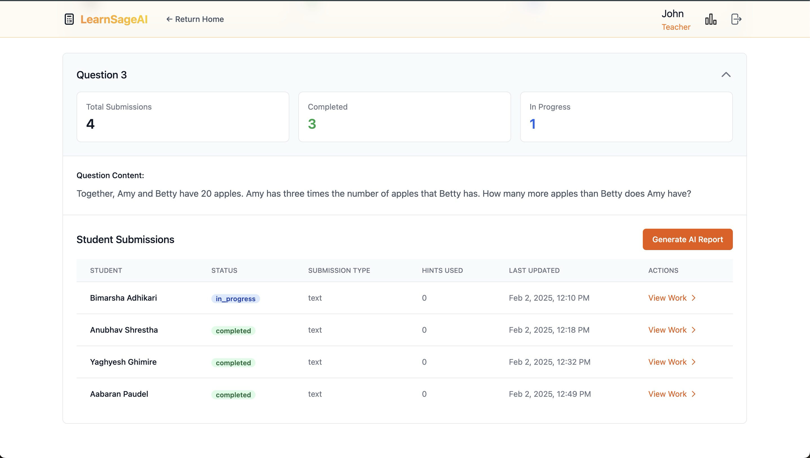
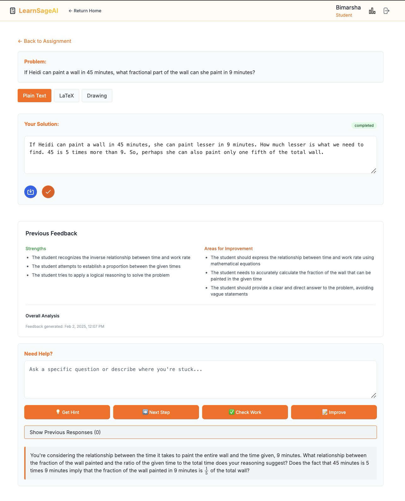

# LearnSageAI 🎓

**The AI-Enhanced Personalized Learning Platform for Teachers and Students**

LearnSageAI is a cutting-edge online learning platform designed to revolutionize the way teachers assign homework and students learn. By harnessing the power of artificial intelligence, we provide a personalized, engaging, and insightful learning experience that benefits both educators and learners.

## The Problem 😕

In the era of rapidly advancing AI and online tools, teachers face a growing challenge: students using these tools to complete homework without truly learning. This not only undermines the purpose of assignments but can also lead to severe consequences in students' educational journey.

Moreover, modern online homework platforms often lack personalization, leaving students disengaged and teachers unable to effectively monitor and guide their progress.

## Our Solution ✨

LearnSageAI tackles these problems head-on by offering a platform that integrates AI responsibly to enhance learning for both teachers and students.

### For Teachers 👨‍🏫👩‍🏫

- Create online classrooms and assignments easily
- Get detailed insights on student performance
- Receive personalized recommendations to optimize teaching

### For Students 👨‍🎓👩‍🎓

- Get AI-assisted problem-solving with hints, next steps, and answer improvements
- Choose to write, type in LaTeX, or draw on a canvas
- Receive personalized session reports to maximize learning

## How It Works ⚙️

1. Teachers create classrooms and assignments
2. Students join and access assignments
3. Students can ask the AI for help while working on problems
4. Students receive personalized reports after completing a problem
5. Teachers view student progress and get AI-powered recommendations

## Integration Potential 🔗

LearnSageAI can integrate with existing platforms like Cengage and Wiley Plus, widely used in universities worldwide, including NYUAD. This positions us as a potential positive disruptor in the education technology space.

## Getting Started 🚀

1. Clone the repo
2. Install dependencies: `npm install`
3. Set up MongoDB
4. Configure `.env` with:
	- `PORT`: Port Number
   - `GROQ_API_KEY`: Your GROQ AI API key
   - `MONGODB_URI`: Your MongoDB connection URI
   - `JWT_SECRET`: A secret for JSON Web Tokens
6. Run the app: `npm start`

## Tech Stack 💻

Node.js, Express.js, MongoDB, Handlebars templating, Tailwind CSS

---

Join our mission to transform education with the power of AI! 🚀
